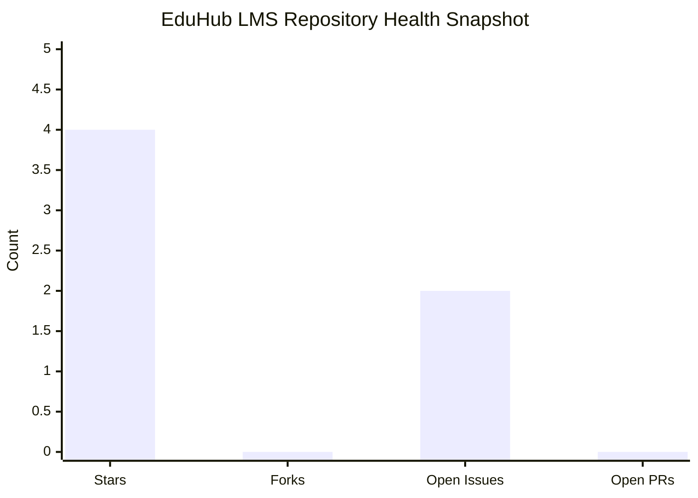
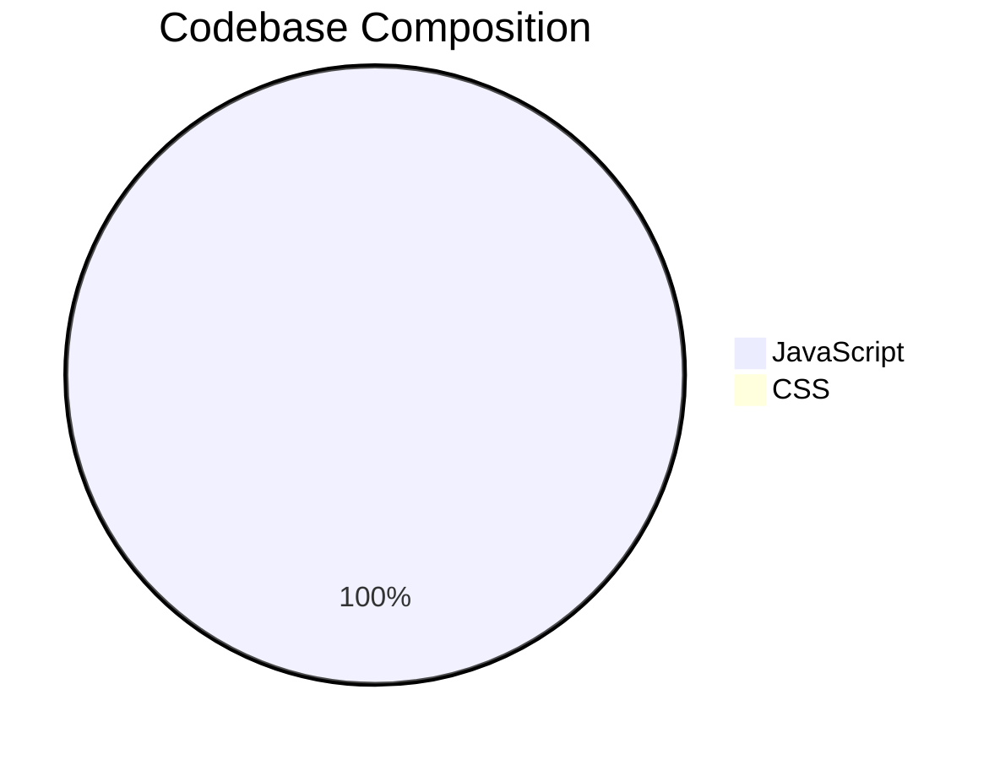
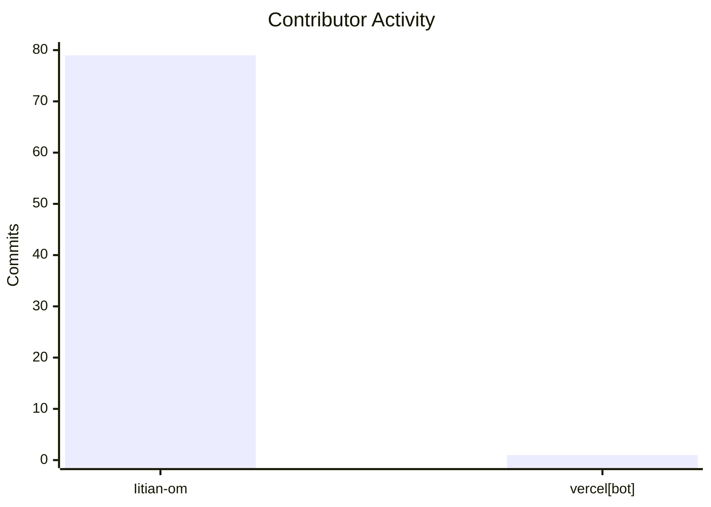

<h1 align="left">EduHub LMS Repository Analytics</h1>

## Overview

This dashboard summarizes the repository's current operating profile using durable GitHub-native signals and lifetime-oriented visualizations. It is intended for maintainers, reviewers, and contributors who need a fast read on health, momentum, and ownership concentration.

## Snapshot

| Metric | Value |
| --- | --- |
| Repository | `Iitian-om/eduhub-lms` |
| GitHub repository id | `1006038378` |
| Owner user id | `190179357` |
| Stars | `4` |
| Forks | `0` |
| Open issues | `2` |
| Contributors | `2` total, `1` active human contributor |
| Default branch | `main` |
| Primary language | `JavaScript` |
| Secondary language | `CSS` |

## Key Performance Indicators

      

## Visual Dashboard

### Repository Health

### Language Distribution

### Contribution Mix

## Lifetime Trends and Reporting Links

These are the primary analytical views for maintainers and reviewers.

### GitHub Native Insights

 [[Pulse](https://github.com/Iitian-om/eduhub-lms/pulse)] [[Contributors](https://github.com/Iitian-om/eduhub-lms/graphs/contributors)] [[Commit Activity](https://github.com/Iitian-om/eduhub-lms/graphs/commit-activity)] [[Code Frequency](https://github.com/Iitian-om/eduhub-lms/graphs/code-frequency)] [[Network Graph](https://github.com/Iitian-om/eduhub-lms/network)] [[Traffic](https://github.com/Iitian-om/eduhub-lms/graphs/traffic)]

### Open Source Reach

 [Stargazers](https://github.com/Iitian-om/eduhub-lms/stargazers)  [Forks](https://github.com/Iitian-om/eduhub-lms/forks)  [Star History](https://star-history.com/#Iitian-om/eduhub-lms&Date)

## Stars Graph

## Third-Party Visual Dashboards (OSS + External)

The following visual cards are sourced from OSS Insight and other third-party analytics providers for richer dashboard-style reporting.

### OSS Insight Widgets

| Activity Trends | Repository Stats |
| --- | --- |
|  |  |

| PR Lifecycle | Lines of Code Over Time |
| --- | --- |
|  |  |

| Active Contributors | Top Contributors |
| --- | --- |
|  |  |

## Analytical Readout

- The repository is currently concentrated in a single primary codebase language, which suggests a focused product surface rather than a broad multi-service platform.
- Contributor activity is highly centralized. That is efficient for small teams, but it increases maintenance risk if ownership is not shared over time.
- Open-source visibility is still modest. The repo has a few stars, no forks, and a limited contribution network, so growth indicators should be interpreted as early-stage signals rather than mature community trends.
- GitHub-native analytics are the most reliable choice here because they load consistently and reflect source-of-truth repository data.

## Maintenance Notes

- Keep this file focused on repository analytics only.
- Use GitHub-native links as the default operational views.
- Treat third-party widgets as optional embellishments, not the dashboard foundation.